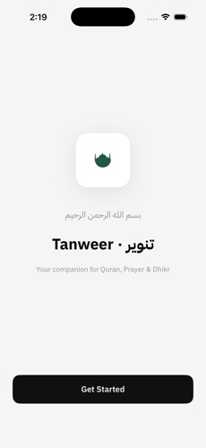
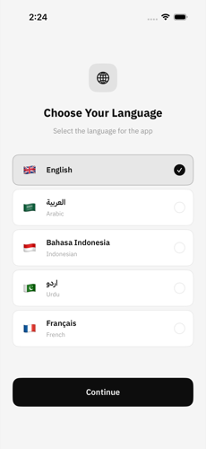
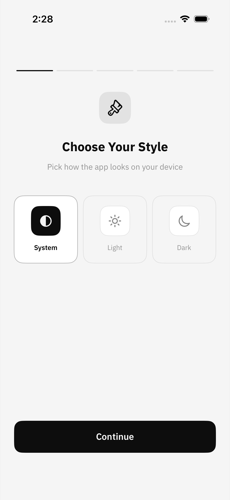
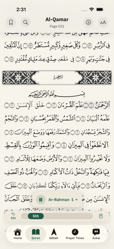
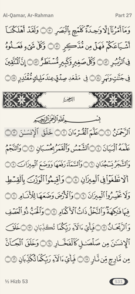
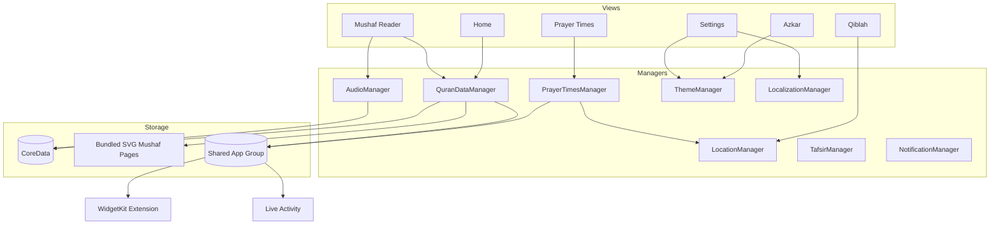

# Tanweer (تنوير) — iOS

A native iOS companion for Quran reading, prayer times, Qiblah direction, and daily
Azkar — built with Swift and SwiftUI, with a Mushaf reader typeset to match the
printed Madani Mushaf page-for-page.

> This repository is a portfolio case study. The app is closed-source; screenshots,
> architecture notes, and engineering write-ups live here so the work can be reviewed
> without exposing the codebase.

**[Download on the App Store →](https://apps.apple.com/om/app/tanweer-enlighten-your-life/id6773591303)**

## Screenshots

  
  
  
  
  

## Tech Stack

- **Swift, SwiftUI, MVVM** — declarative views over observable managers, no third-party UI framework
- **CoreData** — bookmarks, reading progress, downloaded audio/pages
- **Combine** — reactive bindings between managers (audio, location, theme, localization) and views
- **WidgetKit** — 5 home-screen widgets (Continue Reading, Prayer Times, Hijri Date, Verse of the Day, Azkar) plus a Live Activity for audio playback
- **CoreLocation** — Qiblah direction and location-based prayer time calculation
- **AVFoundation** — Quran recitation playback with background audio and lock-screen controls
- **XcodeGen** — the `.xcodeproj` is generated from `project.yml`, keeping the project file diff-free and mergeable
- **Custom font pipeline** — KFGQPC HAFS Uthmanic Script with hand-tuned fixes for Arabic contextual-alternate (`calt`) shaping edge cases (see Engineering Highlights)

## Architecture

Views stay dumb; each feature area owns a manager that is the single source of truth
for that slice of state, injected as an `ObservableObject` and shared across views and
the widget extension via an App Group.

## Engineering Highlights

**Pixel-perfect Mushaf typesetting.** The reader reproduces the printed Madani Mushaf
page-for-page — line breaks, ornate ayah-end badges, and surah-divider banners all
match the physical book, not a reflowed approximation. Pages render from bundled SVGs
rather than plain text, so line-break positions never drift from the print reference.

**A font-shaping bug that only showed up on 3-digit ayah numbers.** Ayah-end badges
render via the HAFS font's `calt` (contextual alternates) GSUB feature, which
auto-composes a run of Arabic-Indic digits into the ornate circular glyph — but the
feature only ships substitution rules for 1–2 digit runs. Any ayah number 100 and
above partially matched, silently dropping or garbling digits. Neither a ligature-
trigger prefix nor ZWNJ-separated digits stopped HAFS from re-triggering `calt`. The
fix: for 3+ digit badges only, draw the circle glyph and the digits as two separate
layers — the circle from HAFS alone (always renders correctly in isolation), the
digits in a plain system typeface with no Quranic shaping rules, scaled to ~60% of
the circle's width. Confirmed by screenshotting a full page of 3-digit ayahs
(135–141) on-device rather than trusting the font tables.

**An onboarding crash that only reproduced after a fresh install.** `SplashView` and
`LanguagePickerView` shared a `.id()` view-identity tied to the same state object;
switching languages during onboarding caused SwiftUI to tear down and reconstruct the
tree mid-transition, crashing. Fixed by moving the `.id()` binding up to
`ContentView`/`WhatsNewView` so onboarding's language switch no longer forces a
splash-view identity change.

**RTL-first, not RTL-retrofitted.** Arabic and English coexist throughout the same
screens — prayer time cards, Hijri dates, and ayah references all mirror correctly
per-locale rather than uniformly flipping the whole screen, which is what broke Hijri
date wrapping and produced a stray English subtitle inside RTL layouts until both were
tracked down and fixed individually.

## More from this developer

- [Tanweer for Android](https://github.com/lqji/tanweer-android-showcase) — same product, ported to Kotlin + Jetpack Compose
- [Type Faster](https://github.com/lqji/type-faster-showcase) — a typing test with real-time multiplayer racing
- [Full portfolio →](https://github.com/lqji/portfolio)

---

Built and maintained by **Ahmed Abdullah**.
