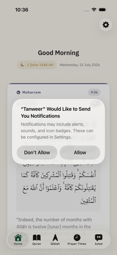
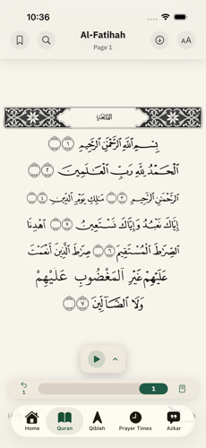
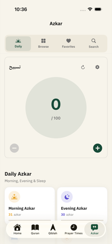

# Tanweer (تنوير) for iOS

Tanweer is an iOS app for reading the Quran, checking prayer times, finding the Qiblah direction, and keeping up with daily Azkar. It is built natively with Swift and SwiftUI, and the Quran reader is typeset to match the printed Mushaf page for page.

This repo is a portfolio case study. The app itself is closed source, so what you will find here is screenshots, a plain explanation of how it is built, and a few of the harder bugs I ran into along the way.

Download it on the App Store: https://apps.apple.com/om/app/tanweer-enlighten-your-life/id6773591303

## Screenshots

  
  
  
  
  

  
  
  

## Stack

Swift and SwiftUI for the app, with CoreData for bookmarks and reading progress. Prayer times and Qiblah direction use the phone's location. Audio playback uses AVFoundation with lock screen controls and a live activity while recitation is playing. There are also five home screen widgets built with WidgetKit. The Xcode project itself is generated from a config file instead of being hand edited, which keeps merges painless.

## How it is put together

The app follows a simple pattern. Views stay light and just display state. Each feature area, audio, prayer times, location, theming, language, has its own manager that owns that piece of state and gets shared wherever it is needed, including with the widgets through an app group.

## Some of the harder problems

The Quran reader was built to match the printed Mushaf exactly, down to line breaks and the ornate circular badges that mark the end of each verse. Pages come from bundled artwork rather than plain text, so nothing reflows or drifts from the print layout.

One bug only showed up on three digit verse numbers. The font used for the verse badges has a feature that automatically draws small groups of digits inside the ornate circle, but it only had rules for one or two digit numbers. Anything past verse ninety nine would render with missing or garbled digits. After a lot of trial and error, the fix was to draw the circle and the digits separately for longer numbers instead of relying on the font to do it automatically.

Another one only showed up on a fresh install during onboarding. Two screens were sharing the same identity under the hood, so switching the app language partway through onboarding caused SwiftUI to tear the whole screen down mid transition and crash. Moving that shared identity higher up the view hierarchy fixed it for good.

Arabic and English live side by side throughout the app, so getting right to left layout correct mattered a lot, not just flipping the whole screen but making sure dates, prayer cards, and mixed text all mirror the way they actually should.

## Also by me

Tanweer for Android: https://github.com/lqji/tanweer-android-showcase
Type Faster: https://github.com/lqji/type-faster-showcase
Full portfolio: https://github.com/lqji/portfolio

Ahmed Abdullah
