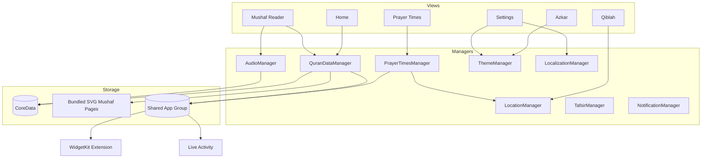

# Tanweer (تنوير) — iOS

A native iOS companion for Quran reading, prayer times, Qiblah direction, and daily
Azkar — built with Swift and SwiftUI, with a Mushaf reader typeset to match the
printed Madani Mushaf page-for-page.

> This repository is a portfolio case study. The app is closed-source; screenshots,
> architecture notes, and engineering write-ups live here so the work can be reviewed
> without exposing the codebase.

**[Download on the App Store →](https://apps.apple.com/om/app/tanweer-enlighten-your-life/id6773591303)**

## Screenshots

  
  
  
  
  

## Tech Stack

- **Swift, SwiftUI, MVVM** — declarative views over observable managers, no third-party UI framework
- **CoreData** — bookmarks, reading progress, downloaded audio/pages
- **Combine** — reactive bindings between managers (audio, location, theme, localization) and views
- **WidgetKit** — 5 home-screen widgets (Continue Reading, Prayer Times, Hijri Date, Verse of the Day, Azkar) plus a Live Activity for audio playback
- **CoreLocation** — Qiblah direction and location-based prayer time calculation
- **AVFoundation** — Quran recitation playback with background audio and lock-screen controls
- **XcodeGen** — the `.xcodeproj` is generated from `project.yml`, keeping the project file diff-free and mergeable
- **Custom font pipeline** — KFGQPC HAFS Uthmanic Script with hand-tuned fixes for Arabic contextual-alternate (`calt`) shaping edge cases (see Engineering Highlights)

## Architecture

Views stay dumb; each feature area owns a manager that is the single source of truth
for that slice of state, injected as an `ObservableObject` and shared across views and
the widget extension via an App Group.

